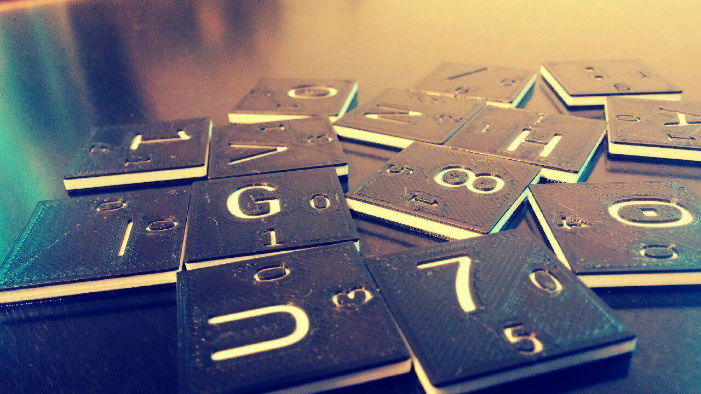

# LS47 hand-computable cipher

This is a slight improvement of the ElsieFour cipher as described by Alan
Kaminsky [1]. We use 7x7 characters instead of original (barely fitting) 6x6,
to be able to encrypt some structured information. We also describe a simple
key-expansion algorithm, because remembering passwords is popular. Similar
security considerations as with ElsieFour hold.

There's also a 3D-printable SCAD model of the whole thing. Yay!



We suggest printing the model using more than one filament color to make the
letters easily recognizable. Thanks go to Martin Ptasek for providing the
picture.

If you trust your computer, there are several LS47 implementations around:

- A very simple python implementation in available here in `ls47.py`.
- A much better version usuable as an actual binary (also supporting several
  versions of padding and the original ElsieFour cipher) was supplied by
  Bernhard Esslinger from the CrypTool project, available in `lc4.py`.
- Javascript version (npm-compatible) of the cipher implementations was created
  by Ulysse McConnell, available at https://github.com/umcconnell/lc4

### Character board

We have added some real punctuation, basic stuff for writing expressions,
punctuation and quotes. The letters of the board now look like this:

```
_ a b c d e f
g h i j k l m
n o p q r s t
u v w x y z .
0 1 2 3 4 5 6
7 8 9 , - + *
/ : ? ! ' ( )
```

Zoomed in, it's very practical to have extra position information written on
the tiles:

```
/-----\  /-----\  /-----\  /-----\  /-----\
|     |  |     |  |     |  |     |  |     |
| _  0|  | a  1|  | b  2|  | c  3|  | d  4|  ...
|   0 |  |   0 |  |   0 |  |   0 |  |   0 |
\-----/  \-----/  \-----/  \-----/  \-----/

/-----\  /-----\
|     |  |     |
| g  0|  | h  1|  ...
|   1 |  |   1 |
\-----/  \-----/
   .        .
   .        .
   .        .
```

To run (hand-run) the encryption/decryption, you will also need some kind of a
marker (e.g. a small shiny stone, bolt nut or similar kind of well-shaped
trash).

## How-To

You may as well see the paper [1], there are also pictures. This is somewhat more concentrated:

### Encryption

1. The symmetric key is the initial state of the board. Arrange your tiles to 7x7 square according to the key.
2. Put the marker on (0,0).
3. Find the next letter you want to encrypt on the board, its position is `P`.
4. Look at the marker; numbers written on the marked tile are coordinates `M`.
5. Compute position of the ciphertext as `C := P + M mod (7,7)`. Output the letter found on position `C` as ciphertext.
6. Rotate the row that contains the plaintext letter one position to the right, but do not carry the marker if present (it should stay on the same coordinates).
7. Rotate the column that now (after the first rotation) contains the ciphertext letter one position down, also not carrying the marker.
8. Update the position of the marker: `M := M + C' mod (7,7)` where `C'` are the numbers written on the ciphertext tile.
9. Repeat from 3 as many times as needed to encrypt the whole plaintext.

#### Encryption example with ascii images!

```
1,2. Symmetric key with         3,4. We want to encrypt 'y'.
     marker put on 'e'               Look at the marked tile:

  [e]f _ a b c d                     /-----\
   l m g h i j k                     |     |
   ( ) / : ? ! '                     | e  5|
   s t n o p q r                     |   0 |
   z . u v w x y                     \-----/
   5 6 0 1 2 3 4
   + * 7 8 9 , -

5. Ciphertext is 'w'            6. Rotate the plaintext 1 position
   (='y' moved by (5,0))           right, keep marker coordinates.

                               [e]f _ a b c d        [e]f _ a b c d
   Output 'w'!                  l m g h i j k         l m g h i j k
                                ( ) / : ? ! '         ( ) / : ? ! '
                                s t n o p q r         s t n o p q r
                                  z . u v w x y  >>   y z . u v w x
                                5 6 0 1 2 3 4         5 6 0 1 2 3 4
                                + * 7 8 9 , -         + * 7 8 9 , -


7. Rotate the ciphertext 1         Now look at the ciphertext tile:
   position down.

   [e]f _ a b , d                       /-----\
    l m g h i c k                       |     |
    ( ) / : ? j '                       | w  2|
    s t n o p ! r                       |   3 |
    y z . u v q x                       \-----/
    5 6 0 1 2 w 4
    + * 7 8 9 3 -

8. Update the marker position         9. GOTO 3.
   by ciphertext offset (2,3).


    e f _ a b , d
    l m g h i c k
    ( ) / : ? j '
    s t[n]o p ! r
    y z . u v q x
    5 6 0 1 2 w 4
    + * 7 8 9 3 -


```

### Decryption

Decryption procedure is basically the same, except that in step 5 you know `C`
and `M`, and need to produce `P` by subtraction: `P := C - M mod (7,7)`.
Otherwise (except that you input ciphertext and output plaintext) everything
stays the same.

### Key generation

Grab a bag full of tiles and randomly draw them one by one. Key is the 49-item permutation of them.

## Modifications

### Key expansion from a password

Remembering 49-position random permutation that includes weird characters is
not very handy. You can instead derive the keys from an arbitrary string of
sufficient length.

"Sufficient" means "provides enough entropy". Full keys store around 208 bits
of entropy. To reach that, your password should have:

- at least around 61 decimal digits if made only from random decimal digits
- at least around 44 letters if made only from completely random letters
- at least around 40 alphanumeric characters if made randomly only from them

To have the "standard" 128 bits of entropy, the numbers reduce to roughly 39,
28 and 25, respectively.

Note that you can save the expanded tile board for later if you don't want to
expand the passwords before each encryption/decryption.

The actual expansion can be as simple as this:

1. initialize `I:=0`, put the tiles on the board sorted by their numbers (i.e. as on the picture above)
2. Take the first letter of the password and see the numbers on its tile; mark them `Px, Py`.
3. Rotate `I`-th row `Px` positions right
4. Rotate `I`th column `Py` positions down
5. `I := I + 1 mod 7`, repeat from 2 with next letter of the password.
6. Resulting tile positions are the expanded key

### Undistinguishable ciphertexts

To get a different ciphertext even if the same plaintext is encrypted
repeatedly; prepend it with a nonce. A nonce is a completely random sequence of
letters of a pre-negotiated length (e.g. N tiles drawn randomly from a bag,
adviseable value of N is at least 10).

You may also want to add a random number of spaces to the end of the ciphertext
-- it prevents the enemy from seeing the difference between ciphertexts of 'yes
please' and 'no', which would otherwise encrypt to gibberish that is easily
distinguishable by length, like `qwc3w_cs'(` and `+v`.

### Authenticated encryption

Because ciphertext may be altered in the transfer or during the error-prone
human processing, it is advised to append a simple "signature" to the end of
the message; which may look as simple as `__YourHonorableNameHere`. If the
signature doesn't match expectations (which happens with overwhelming
probability if there was any error in the process), either try again to see if
you didn't make a mistake, or discard the message and ask the sender to
re-transmit.

This works because the cipher output is message-dependent: Having a wrong bit
somewhere in the middle causes avalanche effect and erases any meaning from the
text after several characters.

### Alternative playing-card-compatible board

The following board can be used so that characters and offsets can be easily
mapped to playing cards, similar to the Solitaire cipher [2]. Using playing
cards could be more innocuous and easily explainable to the secret police than
a set of peculiar numbered tiles.

```
a b c d e f g
h i j k l m n
o p q r s t u
v w x y z _ .
, - + * / : ?
! ' ( ) 1 2 3
4 5 6 7 8 9 0
```

**This board uses a 1-based index**, so `a=1`, `b=2`, and so on. With this layout, 
the following mapping to playing cards is used:

| **Character** | Card | Index | **Character** | Card | Index | **Character** | Card | Index | **Character** | Card | Index  |
|-----------|------|-------|-----------|------|-------|-----------|------|-------|-----------|------|--------|
| a         | A♦   | 1     | n         | A♣   | 14    | _         | A♥   | 27    | 1         | A♠   | 40     |
| b         | 2♦   | 2     | o         | 2♣   | 15    | .         | 2♥   | 28    | 2         | 2♠   | 41     |
| c         | 3♦   | 3     | p         | 3♣   | 16    | ,         | 3♥   | 29    | 3         | 3♠   | 42     |
| ...       | ...  | ...   | ...       | ...  | ...   | ...       | ...  | ...   | ...       | ...  | ...    |
| j         | 10♦  | 10    | w         | 10♣  | 23    | !         | 10♥  | 39    | 7         | 7♠   | 46     |
| k         | J♦   | 11    | x         | J♣   | 24    | '         | J♥   | 39    | 8         | 8♠   | 47     |
| l         | Q♦   | 12    | y         | Q♣   | 25    | (         | Q♥   | 39    | 9         | 9♠   | 48     |
| m         | K♦   | 13    | z         | K♣   | 26    | )         | K♥   | 39    | 0         | 10♠  | 49 (0) |

The (x, y) offset can be calculated by first determining the index: take the
number of the suit (0-3), multiply by 13, and add the card number (using 1 for
the Ace, 11-13 for face cards). Then, determine the offset from the index
using the usual modular arithmetic: `x = index % 7` and `y = index / 7`.

Alphanumeric characters can be easily mapped to cards, with letters mapping to
Diamonds or Clubs and numbers mapping to Spades (note that Spades face cards
are ommitted). All of the special characters are mapped to the Hearts, though
coming up with a mnemonic for the mapping of each special character to each
Heart is left as an exercise for the reader.

For an example, view [this image](card-tiles.jpg). In this example, the marker 
is on J♣ (at the top left), and we want to encrypt the plaintext character `e`.

1. From the card mapping, `e` maps to 5♦ (letters `a` through `m` map to Diamonds), which is on the second row. 
1. The marker card, J♣, has: 
    - an index of 24 (Clubs are suit 1, and the Jack is the 11th card in the suit): `i = 1 * 13 + 11 = 24`
    - an x-offset of 3: `x = i % 7 = 24 % 7 = 3`
    - a y-offset of 3: `y = i / 7 = 24 / 7 = 3`
1. Using the marker offsets, the ciphertext card is three rows down and three columns to the right of 5♦, which is 6♠. 
1. From the card mapping, 6♠ maps to `6` (Spades map directly to digits), and has:
    - an index of 45 (Spades are suit 3, and 6 is the 6th card in the suit): `i = 3 * 13 + 6 = 45`
    - an x-offset of 3: `x = i % 7 = 45 % 7 = 3`
    - a y-offset of 6: `y = i / 7 = 45 / 7 = 6`
1. We then complete the cipher as normal:
    - Output `6` as the ciphertext
    - Rotate the row containing the plaintext card, 5♦
    - Rotate the column containing the ciphertext card, 6♠
    - Move the marker according to the offsets of the ciphertext card, to the right 3 and down 6 

The image includes the character, index, and offsets for the relevant cards.

For LC4, the following board could be used:

```
a b c d e f
g h i j k l
m n o p q r
s t u v w x
y z _ 2 3 4
5 6 7 8 9 #
```

The "Hearts" suit would be ommitted from the card mapping table, and the index
of each of the Spades would be decreased by 13 to compensate. `#` and `_`
would map to 10♠ and A♠, respectively.

## References

[1] *Kaminsky, Alan. "ElsieFour: A Low-Tech Authenticated Encryption Algorithm For Human-to-Human Communication." IACR Cryptology ePrint Archive 2017 (2017): 339.*  
[2] *Schneier, Bruce. ["The Solitaire Encryption Algorithm"](https://www.schneier.com/academic/solitaire/).*  
